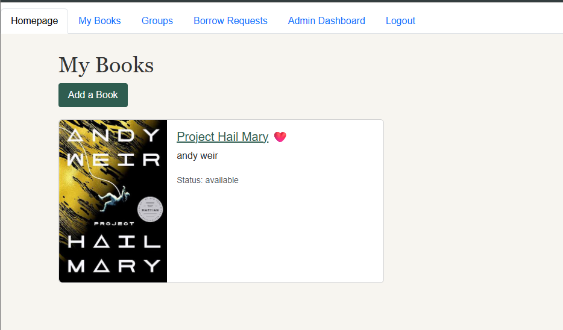
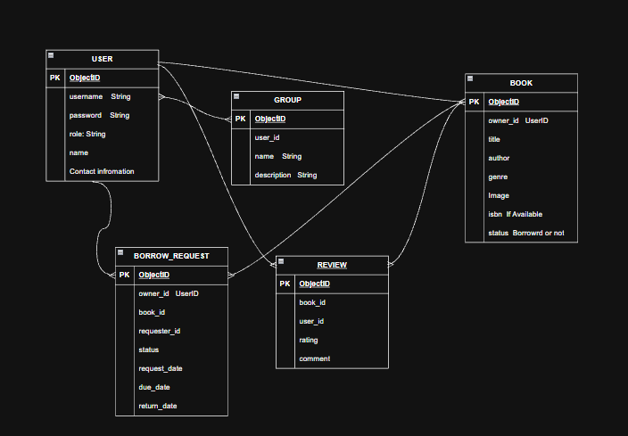

# Project Name

### Book Library

## Overview

### Online book library to keep track of the Books you have and can join Groups with friends and family where you can see the books they have and borrow them

## Screenshots

## Technologies Used

### -Full MERN , HTML, javascript, Css

## Getting Started

1. Create .env and add
   MONGODB_URI=Your mongoose library,
   SESSION_SECRET= Random Session Secret,
   PORT=3000
2. npm init
3. npm i

## User Stories

1. As a user, I want to be able to sign-up
2. As a user, I want to be able to sign-init
3. As a user, I want to be able to add my books with all my information
4. As a user, I want to be able to join a group with my friends and family
5. As a user, I want to be able to borrow my group member books
6. As a user, I want to be able to edit my books

## Database Design

## Routes

### Home

| Method | Route | Description                                          |
| ------ | ----- | ---------------------------------------------------- |
| GET    | `/`   | Homepage (shows the signed-in user's favorite books) |

### Books

| Method | Route                 | Description                                       |
| ------ | --------------------- | ------------------------------------------------- |
| GET    | `/books`              | List the signed-in user's books                   |
| GET    | `/books/new`          | Show the add-book form                            |
| POST   | `/books`              | Add a new book (with optional cover image upload) |
| GET    | `/books/:bookId`      | Show a single book's details                      |
| GET    | `/books/:bookId/edit` | Show the edit form (owner or super admin only)    |
| PUT    | `/books/:bookId`      | Update a book (owner or super admin only)         |
| DELETE | `/books/:bookId`      | Delete a book (owner or super admin only)         |

### Groups

| Method | Route              | Description                                                          |
| ------ | ------------------ | -------------------------------------------------------------------- |
| GET    | `/groups`          | List the user's groups (super admin sees all groups)                 |
| GET    | `/groups/:groupId` | Show a group's members and their books (members or super admin only) |

### Borrowing

| Method | Route                 | Description                                                             |
| ------ | --------------------- | ----------------------------------------------------------------------- |
| GET    | `/borrow`             | Show received and sent borrow requests                                  |
| POST   | `/borrow`             | Send a borrow request for a book in a shared group                      |
| PUT    | `/borrow/:id/approve` | Approve a request (book owner only) — marks the book as borrowed        |
| PUT    | `/borrow/:id/reject`  | Reject a request (book owner only)                                      |
| PUT    | `/borrow/:id/return`  | Mark a book as returned (book owner only) — marks the book as available |

### Users

| Method | Route            | Description                          |
| ------ | ---------------- | ------------------------------------ |
| GET    | `/users/:userId` | View a user's profile and book count |

### Admin (super admin only)

| Method | Route                                    | Description                                                        |
| ------ | ---------------------------------------- | ------------------------------------------------------------------ |
| GET    | `/admin`                                 | Admin dashboard with all groups and users                          |
| GET    | `/admin/groups/new`                      | Show the create-group form                                         |
| POST   | `/admin/groups`                          | Create a new group                                                 |
| DELETE | `/admin/groups/:groupId`                 | Delete a group                                                     |
| GET    | `/admin/groups/:groupId/edit`            | Manage a group's members                                           |
| POST   | `/admin/groups/:groupId/members`         | Add a member to a group by username                                |
| DELETE | `/admin/groups/:groupId/members/:userId` | Remove a member from a group                                       |
| DELETE | `/admin/users/:userId`                   | Delete a user, remove them from all groups, and delete their books |

## Features

1. **Full CRUD for books** — create, view, edit, and delete books, including cover image uploads.
2. **User authentication** — sign up, sign in, and sign out with bcrypt-hashed passwords and session-based login.
3. **Role-based access** — regular users and a super admin with extra permissions.
4. **Groups** — users only see books from members of the groups they belong to.
5. **Borrowing system** — request to borrow a book from someone in a shared group; owners can approve, reject, or mark it as returned, and the book's status updates automatically.
6. **Favorites** — mark books as favorites and see them on the homepage.
7. **User profiles** — view a user's profile and how many books they own.
8. **Admin dashboard** — create/delete groups, add/remove members, and delete users.

## Future Enhancements

1. Search and filter books by title, author, or genre.
2. Due dates and reminders for borrowed books.
3. Notifications when a borrow request is received, approved, or rejected.
4. Book reviews and ratings.
